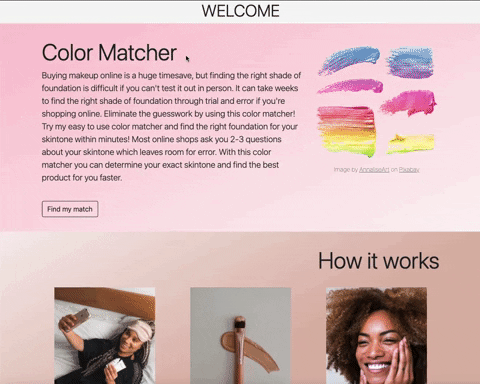

# ColorMatcher
## A simple web app to help you find the perfect shade of foundation
You may use ColorMatcher at [https://vast-sands-67948.herokuapp.com](https://vast-sands-67948.herokuapp.com/index.html)

Click [here](https://youtu.be/hyqoQxeOs4I) to see a (slightly) longer demo of how to use ColorMatcher!

With this easy to use web app I hope to remove the guesswork involved in shopping for foundation virtually. I also wanted to use this as an opportunity to learn how to create a full-stack web application. ColorMatcher is a Node.js app backed by MongoDB Atlas and hosted on Heroku. This repository contains the source code for this application, inside the root directory you will find the following core folders and files:

Root Directory

1. bin
    - www
2.  database
    - db.js
3. public
    - images
    - javascripts
        - frontend.js
    - stylesheets
        - style.css
    - index.html
    - capture.html
4. Routes
    - index.js
* .eslintrc.js
* .prettierrc.json
* app,js
* package-lock.json
* package.json

To install and run the application locally you will need to download all of the above, including the contents inside subdirectories. You will also need to download and install [MongoDB](https://docs.mongodb.com/manual/installation/). I've created this [MongoDB tutorial](https://docs.google.com/document/d/1nzWnD9vSUSv72Kb-Tg_khQ90ptvDhWftoqAM-JAUudI/edit) for setting up a local MongoDB server. Finally, to run this app on your own machine you will need to install [Node.js](https://nodejs.org/en/download/). I've created this [Node.js tutorial](https://docs.google.com/document/d/1_fU-Ka_3ZnCgHPkUwItE9cH5LHI6aUIGCqO10D50_bU/edit) to help you run the app locally.

See the presentation slides, as well as a list of the resources used, [here](https://docs.google.com/presentation/d/1Tv9ERqGb_XRhBtMxDNRAwd-MD48rsYcuJMZjpkGov_4/edit#slide=id.p).

This  app was created by me, Hasti Gheibi Dehnashi, for my Web Development course at Northeastern University. To learn more about this course please visit [the course website](https://johnguerra.co/classes/webDevelopment_spring_2021/).
